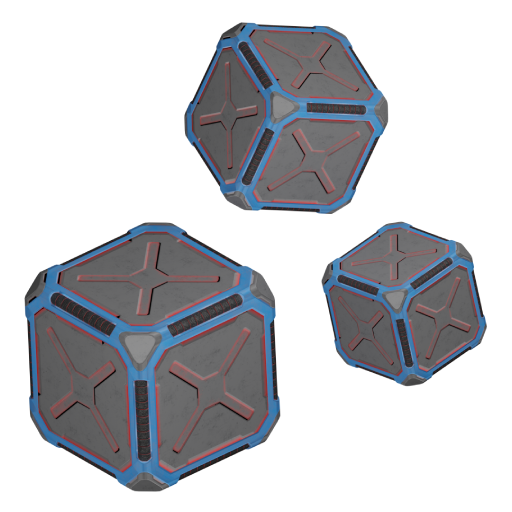
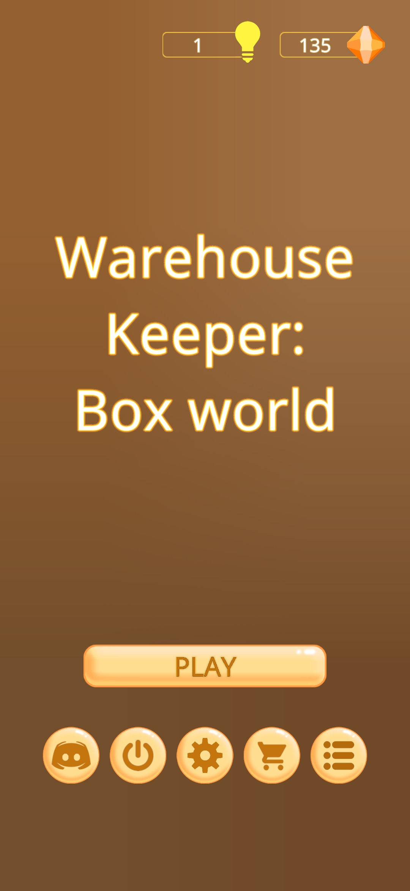
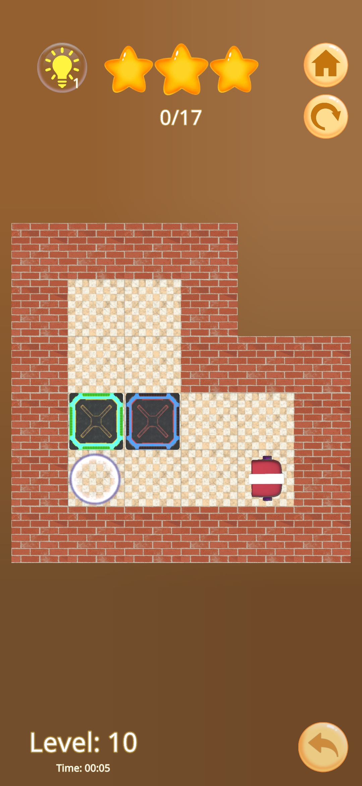
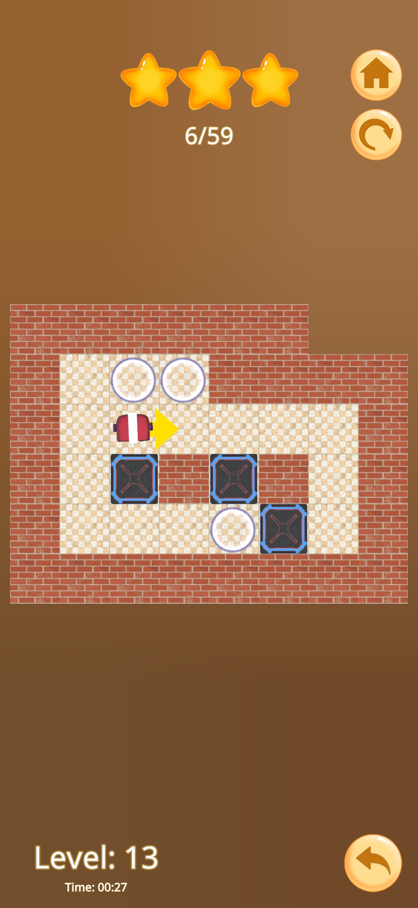
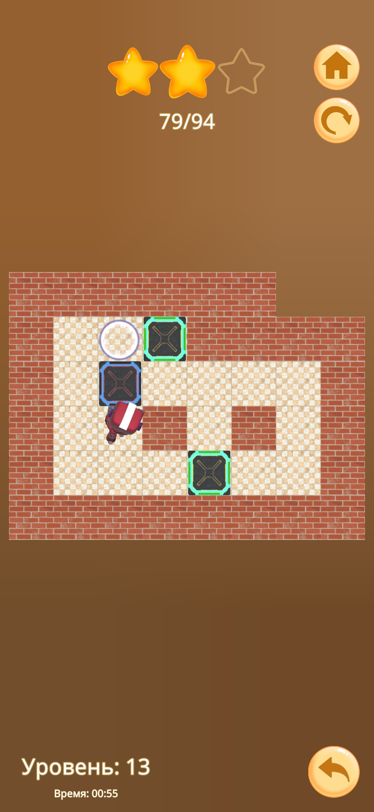

<div align="center">
  

# Warehouse Keeper: Box World  

_The logic game Sokoban_

[](https://unity.com/)
[](https://discord.gg/udWD2NCvc6)
[](https://play.google.com/store/apps/details?id=com.gexetr.warehousekeeperboxworld)
[](https://www.appbrain.com/app/warehouse-keeper-box-world/com.gexetr.warehousekeeperboxworld)
[](https://apkpure.com/p/com.gexetr.warehousekeeperboxworld)
</div>

## How to Run

1.  **Clone the repository:**
    ```bash
    git clone --recurse-submodules https://github.com/VSobolenko/WarehouseKeeper-BoxWorld
    ```

2.  **If you forgot `--recurse-submodules`:**
    ```bash
    git submodule update --init --recursive
    ```
3. Open and Run *Assets/_WarehouseKeeper/Scenes/Main.unity* scene

## Description  
Train your brain and solve challenging puzzles in this **Sokoban-style** logic game!  
Move boxes strategically to complete levels and become a true warehouse master.  

## References  
Check out similar games:  
1. [Push Box](https://play.google.com/store/apps/details?id=com.rafaelwmartins.pushbox)  
2. [Humbug](https://play.google.com/store/apps/details?id=com.dunderbit.humbug)  
3. [Sokoban Free](https://play.google.com/store/apps/details?id=br.com.orangevoid.sokobanfree)  
4. [Sokoban Candy](https://play.google.com/store/apps/details?id=com.NixtorGameStudio.SokobanCandy)  
5. [Sokoban Classic](https://play.google.com/store/apps/details?id=com.mobirix.sokoban)  
6. [Boxy Hero](https://play.google.com/store/apps/details?id=com.kunio.boxyhero)  

## Screenshots  
|  |  |  |  |  
|---|---|---|---|  

<div align="center">
  <sub>Made with ❤️ by Gexetr</sub>
</div>
